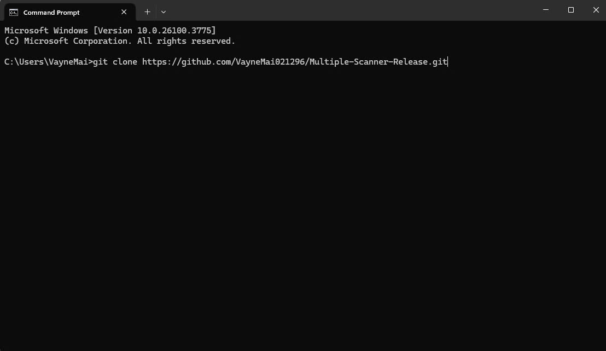
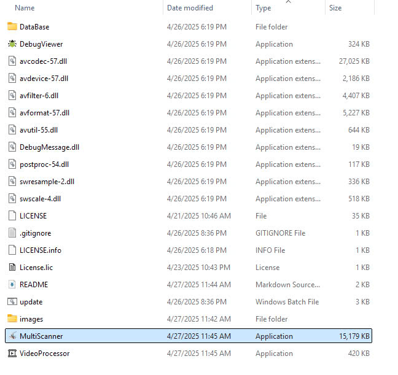
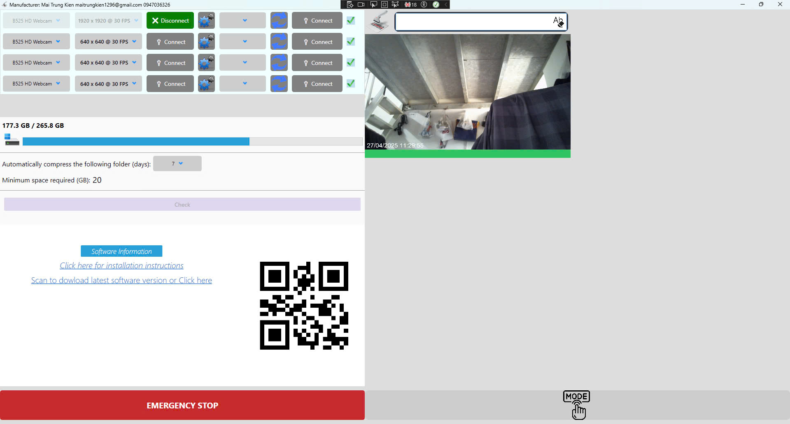

# ShopeeScanner-Release
* Phần mềm ```MultiScanner``` là phần mềm được nâng cấp từ phần mềm [ShopeeScanner](https://github.com/VayneMai021296/ShopeeScanner-Release.git)
* Sử dụng với nulti camera, multi barcode. Mỗi máy quét mã vạch sẽ tương ứng với một Camera

## Video Demo Sản phần 
*[Link_Demo_MultiScanner](https://youtu.be/QL1MZo9gIO8)*


###  Giới thiệu và mô tả tính năng 
```
1. Ứng dụng này được tạo ra với mục đích hỗ trợ ghi hình quá trình đóng gói sản phẩm bằng cách sử dụng máy quét mã vạch thông qua giao tiếp USB-COM.
   Ứng dụng bắt đầu ghi hình quá trình đóng gói khi quét một mã vạch và kết thúc khi quét lại mã vạch đó hoặc một mã vạch mới.
```
```
2. Ứng dụng có tính năng tìm kiếm video theo mã vạch, tìm kiếm theo khoảng thời gian ngày và giờ, đồng thời cho phép nhập thủ công hoặc sử dụng máy quét để tìm kiếm.
```

```
3. Ứng dụng cho phép bạn chọn lưu video với tên file là mã đơn hàng có thể ghi đè hoặc không ghi đè.

```

```
4. Ứng dụng tự động cập nhật lên phiên bản mới nhất khi quét mã vạch cập nhật.

```

# Cách chạy ứng dụng

###  Tải Ứng Dụng về máy tính cá nhân của bạn bằng cách mở Terminal (của window) lên và gõ lệnh 
```shell
git clone https://github.com/VayneMai021296/Multiple-Scanner-Release.git
```
<br>

###   Sau đó bạn nhấn 2 lần chuột trái vào file MultiScanner.exe (Có hình là mã máy quét Barcode đang quét mã) như hình vẽ dưới đây để chạy ứng dụng 


```CSS
-Multiple-Scanner-Release
    |- .gitignore
    |- MultiScanner.exe
    |- ...
    |- LICENSE
    |- LICENSE.lic
```
<br>

<br>


